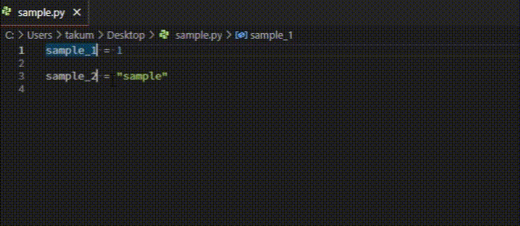

# Python Function Spreader
指定した関数を指定範囲の言葉に対して囲う事ができます。

## Features
既定ではprint("word", word)とlogger.info("word")が実行できます。
`word`は拡張機能実行した時の範囲文字です。

>   

## Extension Settings
この拡張機能は以下の設定を提供します。

* `python-function-spreader.function-list`: 散布する関数をリストで追加できます。

## Known Issues
Linuxでは動作確認ができていません。

## Release Notes

### 0.0.1
初回リリース

## 今後の予定
* [ ] 関数指定を簡単にする
* [ ] 実行した箇所を記憶しておいて、後からOn/Offできる
* [ ] 